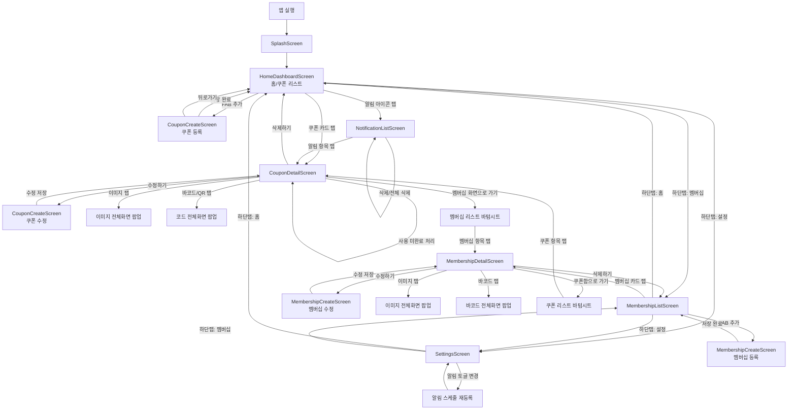
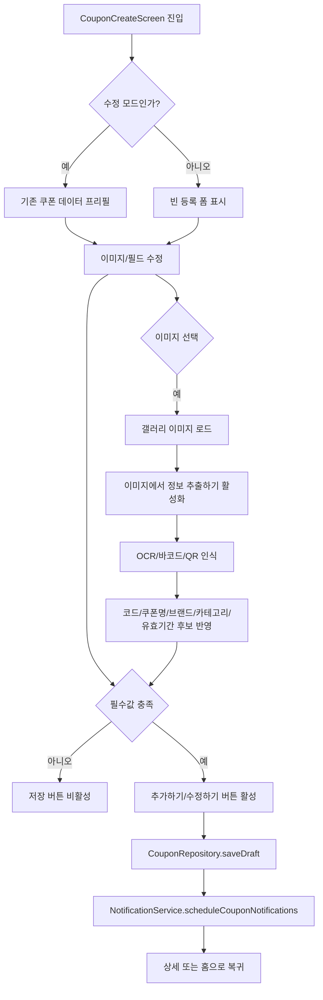
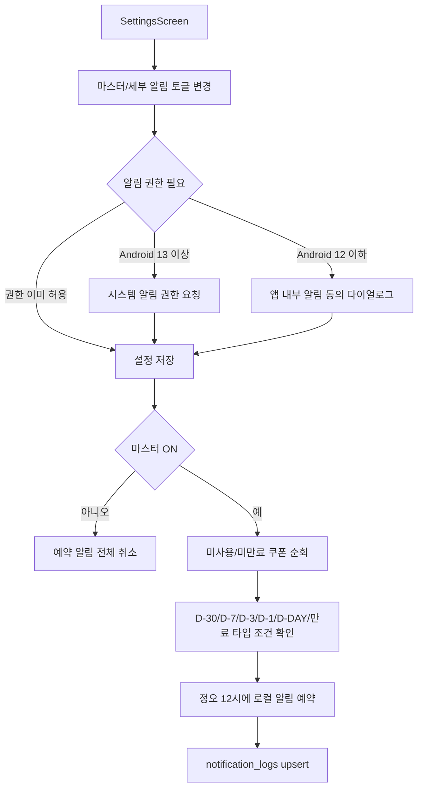

# 화면 흐름도

## 1. 전체 화면 이동 흐름



## 2. 알림 클릭 라우팅 흐름

```mermaid
flowchart TD
  A[OS 로컬 알림 수신] --> B{사용자가 알림 클릭}
  B --> C[NotificationService payload 파싱<br/>couponId|type]
  C --> D{쿠폰 존재 여부}
  D -->|없음| E[라우팅 중단]
  D -->|있음| F[알림 로그 읽음 처리]
  F --> G[홈 화면으로 스택 재구성]
  G --> H[CouponDetailScreen으로 이동]
  H --> I{앱 종료 후 아이콘으로 재실행}
  I --> J[SplashScreen]
  J --> K[HomeDashboardScreen]
```

## 3. 쿠폰 등록/수정 상세 흐름



## 4. 설정 토글과 알림 재스케줄 흐름


