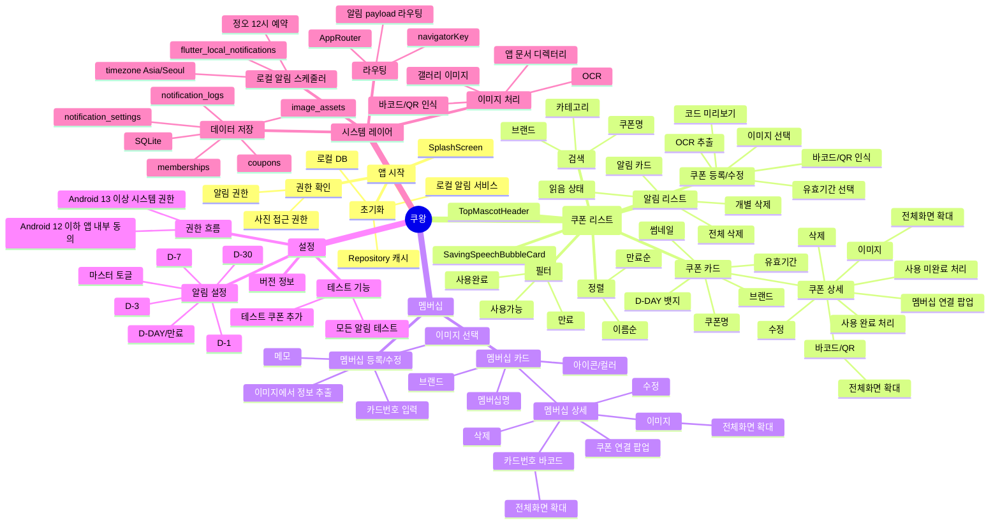

# 정보구조도

## 1. Mermaid Mindmap



## 2. 계층형 구조

```text
쿠왕
├─ SplashScreen
│  ├─ 앱 초기화
│  ├─ 권한 확인
│  └─ 홈 이동
├─ 홈 (쿠폰 리스트)
│  ├─ 절약 말풍선
│  ├─ 쿠폰 검색/필터/정렬
│  ├─ 쿠폰 카드
│  │  └─ 쿠폰 상세
│  │     ├─ 이미지 확대
│  │     ├─ 바코드/QR 확대
│  │     ├─ 사용 완료/미완료 처리
│  │     ├─ 수정/삭제
│  │     └─ 멤버십 리스트 바텀시트
│  ├─ 쿠폰 등록/수정
│  │  ├─ 갤러리 이미지 선택
│  │  ├─ OCR/바코드/QR 인식
│  │  └─ 코드 미리보기
│  └─ 알림 리스트
│     ├─ 읽음 처리
│     ├─ 개별 삭제
│     └─ 전체 삭제
├─ 멤버십
│  ├─ 멤버십 카드
│  │  └─ 멤버십 상세
│  │     ├─ 이미지 확대
│  │     ├─ 바코드 확대
│  │     ├─ 수정/삭제
│  │     └─ 쿠폰 리스트 바텀시트
│  └─ 멤버십 등록/수정
│     ├─ 갤러리 이미지 선택
│     └─ 이미지에서 정보 추출
└─ 설정
   ├─ 알림 마스터 토글
   ├─ 알림 주기별 토글
   ├─ 알림 권한/동의 흐름
   ├─ 테스트 알림
   └─ 버전 정보
```
